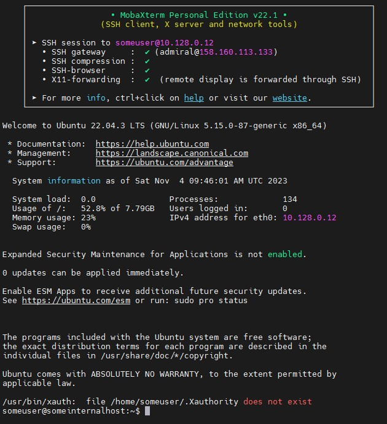

# 5 VPC + Bastion host

1. Create bastion host.


2. Test connection via ssh.


3. Create instance without external IP.


4. Connect to Internal host via Bastion host.




5. Install vpn in bastion host

```bash
cat ./setupvpn.sh
```

```t
sudo tee /etc/apt/sources.list.d/pritunl.list << EOF
deb http://repo.pritunl.com/stable/apt jammy main
EOF

# Import signing key from keyserver
sudo apt-key adv --keyserver hkp://keyserver.ubuntu.com --recv 7568D9BB55FF9E5287D586017AE645C0CF8E292A
# Alternative import from download if keyserver offline
curl https://raw.githubusercontent.com/pritunl/pgp/master/pritunl_repo_pub.asc | sudo apt-key add -

sudo tee /etc/apt/sources.list.d/mongodb-org-6.0.list << EOF
deb https://repo.mongodb.org/apt/ubuntu jammy/mongodb-org/6.0 multiverse
EOF

wget -qO - https://www.mongodb.org/static/pgp/server-6.0.asc | sudo apt-key add -

sudo apt update
sudo apt --assume-yes upgrade

# WireGuard server support
sudo apt -y install wireguard wireguard-tools

sudo ufw disable

sudo apt -y install pritunl mongodb-org
sudo systemctl enable mongod pritunl
sudo systemctl start mongod pritunl
```

```bash
sudo bash ./setupvpn.sh
```

In browser type:

```http
https://158.160.113.133/setup
```


And follow the instructions:

```bash
sudo pritunl setup-key
sudo pritunl default-password
```

## Install SSL certificate

```bash
sudo apt-get install snapd
sudo snap install --classic certbot
sudo ln -s /snap/bin/certbot /usr/bin/certbot
sudo systemctl stop pritunl
sudo certbot certonly --standalone
```

```text
Saving debug log to /var/log/letsencrypt/letsencrypt.log
Enter email address (used for urgent renewal and security notices)
 (Enter 'c' to cancel): temp@test.by

- - - - - - - - - - - - - - - - - - - - - - - - - - - - - - - - - - - - - - - -
Please read the Terms of Service at
https://letsencrypt.org/documents/LE-SA-v1.3-September-21-2022.pdf. You must
agree in order to register with the ACME server. Do you agree?
- - - - - - - - - - - - - - - - - - - - - - - - - - - - - - - - - - - - - - - -
(Y)es/(N)o: y

- - - - - - - - - - - - - - - - - - - - - - - - - - - - - - - - - - - - - - - -
Would you be willing, once your first certificate is successfully issued, to
share your email address with the Electronic Frontier Foundation, a founding
partner of the Let's Encrypt project and the non-profit organization that
develops Certbot? We'd like to send you email about our work encrypting the web,
EFF news, campaigns, and ways to support digital freedom.
- - - - - - - - - - - - - - - - - - - - - - - - - - - - - - - - - - - - - - - -
(Y)es/(N)o: n
Account registered.
Please enter the domain name(s) you would like on your certificate (comma and/or
space separated) (Enter 'c' to cancel): 158.160.115.86.sslip.io
Requesting a certificate for 158.160.115.86.sslip.io

- - - - - - - - - - - - - - - - - - - - - - - - - - - - - - - - - - - - - - - -
Could not bind TCP port 80 because it is already in use by another process on
this system (such as a web server). Please stop the program in question and then
try again.
- - - - - - - - - - - - - - - - - - - - - - - - - - - - - - - - - - - - - - - -
(R)etry/(C)ancel: r

Successfully received certificate.
Certificate is saved at: /etc/letsencrypt/live/158.160.115.86.sslip.io/fullchain.pem
Key is saved at:         /etc/letsencrypt/live/158.160.115.86.sslip.io/privkey.pem
This certificate expires on 2024-02-02.
These files will be updated when the certificate renews.
Certbot has set up a scheduled task to automatically renew this certificate in the background.

- - - - - - - - - - - - - - - - - - - - - - - - - - - - - - - - - - - - - - - -
If you like Certbot, please consider supporting our work by:
 * Donating to ISRG / Let's Encrypt:   https://letsencrypt.org/donate
 * Donating to EFF:                    https://eff.org/donate-le
- - - - - - - - - - - - - - - - - - - - - - - - - - - - - - - - - - - - - - - -
```

```bash
sudo systemctl start pritunl
```

Add URL to server.
