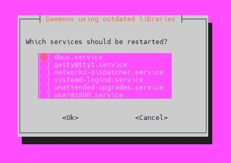
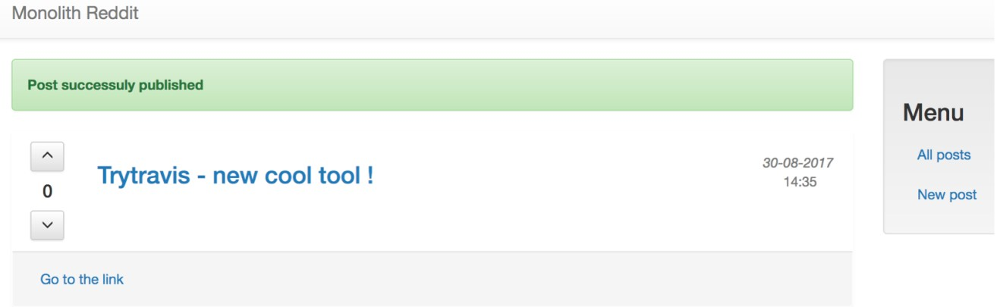

# 6 YC CLI and deploying app

## 1. Create instance using yc app

## 2. Install Ruby and MongoDB

## 3. Deploy test app

### Create instance using yc app

```bash
yc compute instance create --help
```

Set default folder

```bash
yc config set folder-id <Folder-id>
```

Find ids of images.

```bash
yc compute image list --folder-id standard-images --format='json' | jq 'map(select(.family == "ubuntu-2204-lts"))' | jq 'sort_by(.created_at)' | jq '.[] | {family, id, created_at}'
```

```output
{
  "family": "ubuntu-2204-lts",
  "id": "fd8bkgba66kkf9eenpkb",
  "created_at": "2023-07-24T10:51:49Z"
}
{
  "family": "ubuntu-2204-lts",
  "id": "fd8clogg1kull9084s9o",
  "created_at": "2023-08-28T10:53:41Z"
}
{
  "family": "ubuntu-2204-lts",
  "id": "fd82nvvtllmimo92uoul",
  "created_at": "2023-09-11T10:53:12Z"
}
{
  "family": "ubuntu-2204-lts",
  "id": "fd830gae25ve4glajdsj",
  "created_at": "2023-09-18T10:53:56Z"
}
{
  "family": "ubuntu-2204-lts",
  "id": "fd80bm0rh4rkepi5ksdi",
  "created_at": "2023-09-25T10:53:45Z"
}
```

View subnets.

```bash
yc vpc subnet list
```

```output
+----------------------+---------------------------+----------------------+----------------+---------------+-----------------+
|          ID          |           NAME            |      NETWORK ID      | ROUTE TABLE ID |     ZONE      |      RANGE      |
+----------------------+---------------------------+----------------------+----------------+---------------+-----------------+
| b0c2u6i9bkmfdr9moh1i | default-vpc-ru-central1-c | enptekocg5sqrlep7j2c |                | ru-central1-c | [10.130.0.0/24] |
| e2l73ma11v7l0jjq309c | default-vpc-ru-central1-b | enptekocg5sqrlep7j2c |                | ru-central1-b | [10.129.0.0/24] |
| e9b6ppr3mbccdlbnvge7 | default-vpc-ru-central1-a | enptekocg5sqrlep7j2c |                | ru-central1-a | [10.128.0.0/24] |
+----------------------+---------------------------+----------------------+----------------+---------------+-----------------+
```

Create instance.

```bash
yc compute instance create \
  --name test-preemptible-instance \
  --zone ru-central1-a \
  --network-interface subnet-id=e9b6ppr3mbccdlbnvge7,nat-ip-version=ipv4 \
  --preemptible \
  --create-boot-disk image-id=fd80bm0rh4rkepi5ksdi,size=8 \
  --core-fraction 20 \
  --metadata-from-file user-data=metadata.yaml \
  --memory 1 \
  --ssh-key ~/test_key.pub
```

User name will be **yc-user**.

```output
done (35s)
id: fhmts2nc7bi1j954qafm
folder_id: b1g6mmcu4pmqf10ge9g2
created_at: "2023-11-04T18:40:58Z"
name: test-preemptible-instance
zone_id: ru-central1-a
platform_id: standard-v2
resources:
  memory: "2147483648"
  cores: "2"
  core_fraction: "20"
status: RUNNING
metadata_options:
  gce_http_endpoint: ENABLED
  aws_v1_http_endpoint: ENABLED
  gce_http_token: ENABLED
  aws_v1_http_token: DISABLED
boot_disk:
  mode: READ_WRITE
  device_name: fhmolkc2l23edh20lsgd
  auto_delete: true
  disk_id: fhmolkc2l23edh20lsgd
network_interfaces:
  - index: "0"
    mac_address: d0:0d:1d:e0:ae:c3
    subnet_id: e9b6ppr3mbccdlbnvge7
    primary_v4_address:
      address: 10.128.0.20
      one_to_one_nat:
        address: 51.250.94.103
        ip_version: IPV4
gpu_settings: {}
fqdn: fhmts2nc7bi1j954qafm.auto.internal
scheduling_policy:
  preemptible: true
network_settings:
  type: STANDARD
placement_policy: {}
```

### Install Ruby and MongoDB

### Deploy test app

### 1. Create bastion host



Test connection via ssh



### 2. Create instance without external IP


### 3. Connect to Internal host via Bastion host


### 4. Install vpn in bastion host

```bash
cat ./setupvpn.sh
```

```t
sudo tee /etc/apt/sources.list.d/pritunl.list << EOF
deb http://repo.pritunl.com/stable/apt jammy main
EOF

# Import signing key from keyserver
sudo apt-key adv --keyserver hkp://keyserver.ubuntu.com --recv 7568D9BB55FF9E5287D586017AE645C0CF8E292A
# Alternative import from download if keyserver offline
curl https://raw.githubusercontent.com/pritunl/pgp/master/pritunl_repo_pub.asc | sudo apt-key add -

sudo tee /etc/apt/sources.list.d/mongodb-org-6.0.list << EOF
deb https://repo.mongodb.org/apt/ubuntu jammy/mongodb-org/6.0 multiverse
EOF

wget -qO - https://www.mongodb.org/static/pgp/server-6.0.asc | sudo apt-key add -

sudo apt update
sudo apt --assume-yes upgrade

# WireGuard server support
sudo apt -y install wireguard wireguard-tools

sudo ufw disable

sudo apt -y install pritunl mongodb-org
sudo systemctl enable mongod pritunl
sudo systemctl start mongod pritunl
```

```bash
sudo bash ./setupvpn.sh
```

In browser type:

```http
https://158.160.113.133/setup
```


And follow the instructions:

```bash
sudo pritunl setup-key
sudo pritunl default-password
```

Copy password from output and paste it to the form.


### 5. Install SSL certificate

```bash
sudo apt-get install snapd
sudo snap install --classic certbot
sudo ln -s /snap/bin/certbot /usr/bin/certbot
sudo systemctl stop pritunl
sudo certbot certonly --standalone
```

```text
Saving debug log to /var/log/letsencrypt/letsencrypt.log
Enter email address (used for urgent renewal and security notices)
 (Enter 'c' to cancel): temp@test.by

- - - - - - - - - - - - - - - - - - - - - - - - - - - - - - - - - - - - - - - -
Please read the Terms of Service at
https://letsencrypt.org/documents/LE-SA-v1.3-September-21-2022.pdf. You must
agree in order to register with the ACME server. Do you agree?
- - - - - - - - - - - - - - - - - - - - - - - - - - - - - - - - - - - - - - - -
(Y)es/(N)o: y

- - - - - - - - - - - - - - - - - - - - - - - - - - - - - - - - - - - - - - - -
Would you be willing, once your first certificate is successfully issued, to
share your email address with the Electronic Frontier Foundation, a founding
partner of the Let's Encrypt project and the non-profit organization that
develops Certbot? We'd like to send you email about our work encrypting the web,
EFF news, campaigns, and ways to support digital freedom.
- - - - - - - - - - - - - - - - - - - - - - - - - - - - - - - - - - - - - - - -
(Y)es/(N)o: n
Account registered.
Please enter the domain name(s) you would like on your certificate (comma and/or
space separated) (Enter 'c' to cancel): 158.160.115.86.sslip.io
Requesting a certificate for 158.160.115.86.sslip.io

- - - - - - - - - - - - - - - - - - - - - - - - - - - - - - - - - - - - - - - -
Could not bind TCP port 80 because it is already in use by another process on
this system (such as a web server). Please stop the program in question and then
try again.
- - - - - - - - - - - - - - - - - - - - - - - - - - - - - - - - - - - - - - - -
(R)etry/(C)ancel: r

Successfully received certificate.
Certificate is saved at: /etc/letsencrypt/live/158.160.115.86.sslip.io/fullchain.pem
Key is saved at:         /etc/letsencrypt/live/158.160.115.86.sslip.io/privkey.pem
This certificate expires on 2024-02-02.
These files will be updated when the certificate renews.
Certbot has set up a scheduled task to automatically renew this certificate in the background.

- - - - - - - - - - - - - - - - - - - - - - - - - - - - - - - - - - - - - - - -
If you like Certbot, please consider supporting our work by:
 * Donating to ISRG / Let's Encrypt:   https://letsencrypt.org/donate
 * Donating to EFF:                    https://eff.org/donate-le
- - - - - - - - - - - - - - - - - - - - - - - - - - - - - - - - - - - - - - - -
```

```bash
sudo systemctl start pritunl
```

Add URL to server.


Check **trusted** connection.


